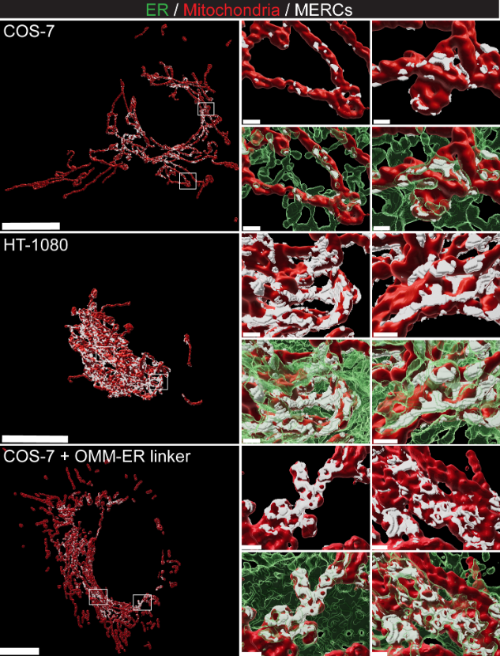
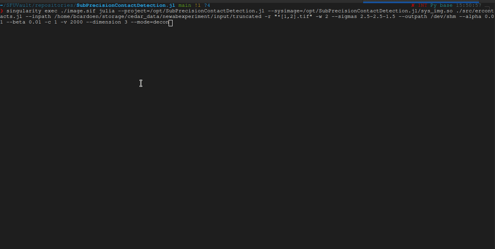

# SubPrecisionContactDetection.jl

Detects sub-precision contacts between subcellular organelles in 2 and 3D STED (precision ~ 50-150nm)
superresolution microscopy, for example endoplasmum reticulum and mitochondria (contacts ~ 20-100nm).

Where a pixel precise segmentation is not feasible due to the precision of the microscope, and colocalization does not describe the interface in a meaningful way, SubPrecisionContactDetection can reconstruct the plausible interace between the organelles.

An example rendering of the postprocessed contact zones (white) between endoplasmum reticulum (green) and mitochondria (red) is shown here [(source)](https://www.biorxiv.org/content/10.1101/2022.06.23.497346v1.full.pdf):



### Features
- Fast: using multiple threads, and Julia's fast LLVM JIT code
- Reproducible : tests ensure backwards compatibility
- Configurable : Can process deconvolved or raw images, with optional extra denoising
- Rich : provides interpretable features for each detected contact

## Test status
[](https://dl.circleci.com/status-badge/redirect/gh/bencardoen/SubPrecisionContactDetection.jl/tree/main)


## Installation
### Portable & fastest way using Singularity

You can use an optimized [Singularity](https://duckduckgo.com/?t=ffab&q=singularity+ce+docs&ia=web) image, which has all dependencies pre-installed.
To run Singularity on Windows, set up [WSL2](https://www.blopig.com/blog/2021/09/using-singularity-on-windows-with-wsl2/).

Download the [image](http://vault.sfu.ca/index.php/s/QJ4Evcet4oVWXPL/download):
```bash
wget http://vault.sfu.ca/index.php/s/QJ4Evcet4oVWXPL/download
```
Save the download image as 'mcsdetect.sif'
```bash
singularity exec mcsdetect.sif julia --project=/opt/SubPrecisionContactDetection.jl -e 'your code'
# or
singularity shell mcsdetect.sif julia --project=/opt/SubPrecisionContactDetection.jl # Interactive
```
#### Optimized version
You can use the pre-compiled version to get a significant boost in execution speed:
```
singularity exec mcsdetect.sif julia --project=/opt/SubPrecisionContactDetection.jl --sysimage=/opt/SubPrecisionContactDetection.jl/sys_img.so -e 'using SubPrecisionContactDetection; SubPrecisionContactDetection.spear(zeros(1024, 1024), zeros(1024, 1024))'
```

### Install as a Julia global package
Assuming you have [Julia](https://julialang.org/):

```julia
julia
julia> using Pkg;
julia> Pkg.add(url="https://github.com/bencardoen/ERGO.jl.git")
julia> Pkg.add(url="https://github.com/bencardoen/SPECHT.jl.git")
julia> Pkg.add(url="https://github.com/bencardoen/SubPrecisionContactDetection.jl.git")
julia> Pkg.activate(".")
julia> Pkg.instantiate(".")
julia> Pkg.build(".")
julia> Pkg.test("SubPrecisionContactDetection")
```

At the end of which, you should see that all tests pass:


### Install locally (to use the processing scripts)
```bash
git clone https://github.com/bencardoen/SubPrecisionContactDetection.jl.git
cd SubPrecisionContactDetection.jl
julia
```
Then in Julia:
```julia
using Pkg; Pkg.activate("."); Pkg.build(); Pkg.instantiate(); Pkg.test();
```
This should result in output similar to this screenshot:


## Detect contacts
The command line interface does the heavy lifting for you:
### Using the singularity image [Recommended]
Using the singularity image not only saves you from dependency tracking, it also is precompiled, making it **x5 - x10 faster**.
This is especially true on clusters where the speedup can be even larger.

```bash
singularity exec ./image.sif julia --project=/opt/SubPrecisionContactDetection.jl --sysimage=/opt/SubPrecisionContactDetection.jl/sys_img.so ./src/ercontacts.jl  --inpath ./in -r "*[1,2].tif" -w 2 --deconvolved --sigmas 2.5-2.5-1.5 --outpath  ./out --alpha 0.01 --beta 0.01 -c 1 -v 2000 --mode=decon
```
### Using the clone repo
```bash
julia --project=. ./src/ercontacts.jl --inpath ./in -r "*[1,2].tif" -w 2 --deconvolved --sigmas 2.5-2.5-1.5 --outpath  ./out --alpha 0.01 --beta 0.01 -c 1 -v 2000 --mode=decon 2>&1 | tee -a log_test.txt
```
Where:
* --{in|out}path : directories where tif files can be found
* -r : regex to tif files, e.g. *[1,2].tif indicates channel 1 and 2 will have filenames ending in 1,2.tif respectively.
* -w : windowsize, >1 or higher
* --sigmas : smoothing Gaussian, set < precision
* --alpha : max false positive rate (p-value), 0.05 is a common value.
* --beta : max false negative rate (stat. power) 0.05 implies 95% stat power.
* -c 1: postprocess channel 1
* -v 2000: drop all contacts touching objects in channel 1 with volume < 2000
* --mode=decon : input are non deconvolved tiff files
* 2>&1 | tee -a log_test.txt : save any output to log.txt (in addition to showing it in stdout)

The output should look like:



#### Output
- skeleton_contacts.tif
- channel_[1,2].tif
- (non)_vesicle_contacts: mitochondria (channel 1) with volume < 2000 are considered vesicles, split contacts so you can visualize them separately
- channel_1_(non_)vesicle.tif : channel 1 objects (mitochondria) split into < 2000 and > 2000 objects
- raw|gradient|eroded.tif : stages of progressively computed contacts, all but 'eroded' are debug output
- *.csv : features for each contact


### Cite
If you find this project useful, please cite
```bibtex
@article {Cardoen2022.06.23.497346,
	author = {Cardoen, Ben and Gao, Guang and Vandevoorde, Kurt R. and Alan, Parsa and Liu, William and Vogl, A. Wayne and Hamarneh, Ghassan and Nabi, Ivan R.},
	title = {Automatic sub-precision membrane contact site detection identifies convoluted tubular riboMERCs},
	elocation-id = {2022.06.23.497346},
	year = {2022},
	doi = {10.1101/2022.06.23.497346},
	publisher = {Cold Spring Harbor Laboratory},
	URL = {https://www.biorxiv.org/content/early/2022/06/26/2022.06.23.497346},
	eprint = {https://www.biorxiv.org/content/early/2022/06/26/2022.06.23.497346.full.pdf},
	journal = {bioRxiv}
}
```
### Troubleshooting & FAQ

If you have any issues, please create an [issue](https://github.com/bencardoen/SubPrecisionContactDetection.jl/issues/new/choose).

Make sure to include:
- include OS, Julia version
- description of steps to reproduce
- be concise yet complete


#### Can I change the singularity image ?
Yes, if you clone the repository, and are using Linux, you need to do 2 things
- edit [singularity_recipes/recipe.def](singularity_recipes/recipe.def)
- execute [buildimage](buildimage.sh) # Needs sudo
```bash
./buildimage.sh
```
This will rebuild the image, first checking out the latest version of the code.

#### System requirements
Expected RAM usage for images of sizes 500x500x20 ~ 5GB RAM, 2000x2000x70: ~ 50GB RAM, and so on.
By default, all of JULIA_NUM_THREADS cores will be used to run in parallel. > 8 is overkill, so set to 4-8 at most:

```bash
export JULIA_NUM_THREADS=4
```
On desktops this is unlikely to be an issue, but on a cluster node with > 64 cores you will probably get a slowdown if you exceed 8-12 cores.

#### I cloned the repo but I get conflicts during the installation ?
First, make sure you install and clone in a clean environment:
```bash
mdkir mydir
cd mydir
julia
julia> ]
(@v1.x) pkg> activate .
(@v1.x) pkg> update
```
Do not use Julia < 1.7, there's no guarantee that deprecated APIs will still work, and performance and user friendliness of the e.g. the package manager alone make 1.7 the ideal baseline.

##### Memory usage
Current memory usage is higher than it strictly needs to be because we generate a lot of intermediate steps.
In principle we could reduce usage by x2 or more, but it would come at the cost of debugging/interpretability.
