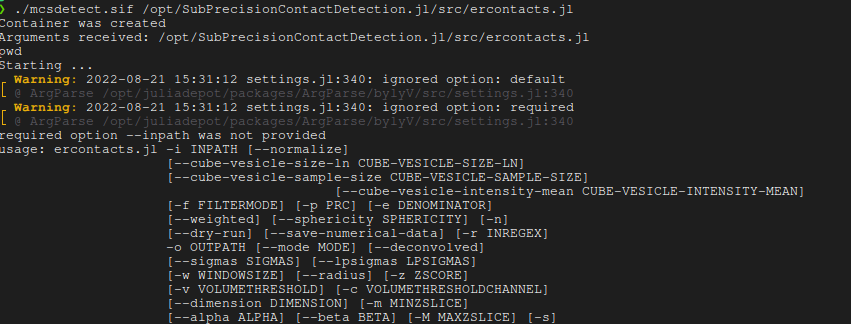

# SubPrecisionContactDetection.jl

Detects sub-precision contacts between subcellular organelles in 2 and 3D STED (precision ~ 50-150nm)
superresolution microscopy, for example endoplasmum reticulum and mitochondria (contacts ~ 20-100nm).

Where a pixel precise segmentation is not feasible due to the precision of the microscope, and colocalization does not describe the interface in a meaningful way, SubPrecisionContactDetection can reconstruct the plausible interface between the organelles.

An example rendering of the postprocessed contact zones (white) between endoplasmum reticulum (green) and mitochondria (red) is shown here [(source)](https://www.biorxiv.org/content/10.1101/2022.06.23.497346v1.full.pdf):


### Features
- Fast: using multiple threads, and Julia's fast LLVM JIT code
- Reproducible: tests ensure backwards compatibility
- Configurable: Can process deconvolved or raw images, with optional extra denoising
- Rich: provides interpretable features for each detected contact
- Confidence map for each voxel (each voxel has a p-value)

### Tutorial
For a hands on tutorial see the [NanoScopyAI pages](https://github.com/NanoscopyAI/tutorial_mcs_detect/tree/main)

## Status
[](https://dl.circleci.com/status-badge/redirect/gh/bencardoen/SubPrecisionContactDetection.jl/tree/main) [](https://www.gnu.org/licenses/agpl-3.0) [](https://codecov.io/gh/bencardoen/SubPrecisionContactDetection.jl)

## Table of contents
1. [Installation](#install)
   1. [Singularity](#singularity)
   2. [Julia package](#julia)
3. [Usage](#usage)
4. [Deploying on clusters](#hpc)
4. [Cite](#cite)
5. [FAQ](#faq)
6. [Parameter selection](#params)
    6.1 [Z-filter](#z)
    6.2 [Window](#w)
    6.3 [Precision and Recall](#alpha)
    6.4 [Vesicle filter](#ves)
    6.5 [Sampling](#sm)
7. [Output](#output)
   1. Contacts
   2. Filtered channels
   3. Confidence map
   4. CSV files

	

<a name="installation"></a>
## Installation
This project is developed using [Julia](https://julialang.org/).
For ease of use and to maximize reproducibility we also provide container images using Singularity.

This project was developed on Linux, and deployed on scientific computing clusters running Linux. The Singularity workflow ensures both local and cluster computations run **exactly** the same. The automated tests run the exact same environment.

This cannot be guaranteed across different OS'es (e.g. Windows, MacOs). While there are no technical reasons preventing the code from working on any OS, you may run into issues as it is not something we actively use ourselves.

<a name="singularity"></a>
### Portable & fastest way using Singularity
You can use an optimized [Singularity](https://docs.sylabs.io/guides/2.6/user-guide/installation.html#) image, which has all dependencies pre-installed.

If you do not have Singularity, please see the documentation for detailed [installation instructions](https://docs.sylabs.io/guides/2.6/user-guide/installation.html#).

The below steps are examples, but may not be complete for each platform, for the reference instructions, please visit [installation instructions](https://docs.sylabs.io/guides/2.6/user-guide/installation.html#).

#### Singularity on Linux
Fedora/RPM
```bash
sudo dnf install singularity
```

#### Singularity on Windows
To run Singularity on Windows, set up [WSL2](https://www.blopig.com/blog/2021/09/using-singularity-on-windows-with-wsl2/) or refer to [installation instructions](https://docs.sylabs.io/guides/2.6/user-guide/installation.html#).

#### Singularity on MacOS
See [instructions](https://docs.sylabs.io/guides/2.6/user-guide/installation.html#install-on-mac).

#### Download the image

Download the [image](http://vault.sfu.ca/index.php/s/QJ4Evcet4oVWXPL/download) as *mcsdetect.sif*.
For example, using wget (Linux), you could do:
```bash
wget -O mcsdetect.sif http://vault.sfu.ca/index.php/s/QJ4Evcet4oVWXPL/download
```

On MacOS you can install wget using:
```bash
brew install wget
```

### Using the image
First, make sure execute permissions are set:
```bash
chmod u+x mcsdetect.sif
```

#### Starting an interactive Julia session
```bash
./mcsdetect.sif
```
Expected output:


#### Running code snippets
```bash
chmod u+x mcsdetect.sif
./mcsdetect.sif -e 'using SubPrecisionContactDetection;'
```
Expected output:


#### Running the analysis scripts
```bash
chmod u+x mcsdetect.sif
./mcsdetect.sif /opt/SubPrecisionContactDetection.jl/scripts/ercontacts.jl ARGS
```
Where you'd replace ARGS with arguments to the script as documented in [scripts/ercontacts.jl](scripts/ercontacts.jl).
Run it without arguments to get the help prompt.

Expected output:


<a name="julia"></a>
### Install as a Julia package

**Note due to a [bug with conda](https://github.com/conda/conda/issues/10111) MacOS installations will have some tests failing, the module itself is functional**

You can either add to the global Julia installation:

```bash
julia -e 'using Pkg;Pkg.add(url="https://github.com/bencardoen/Colocalization.jl.git");Pkg.add(url="https://github.com/bencardoen/ERGO.jl.git");Pkg.add(url="https://github.com/bencardoen/SPECHT.jl.git");Pkg.add(url="https://github.com/bencardoen/SubPrecisionContactDetection.jl.git")'
julia -e 'using Pkg; Pkg.build("SubPrecisionContactDetection");Pkg.test("SubPrecisionContactDetection")'
```


Or create a new environment and install it there:

```bash
mkdir -p test
cd test
julia --project=. -e 'using Pkg;Pkg.add(url="https://github.com/bencardoen/Colocalization.jl.git);Pkg.add(url="https://github.com/bencardoen/ERGO.jl.git");Pkg.add(url="https://github.com/bencardoen/SPECHT.jl.git");Pkg.add(url="https://github.com/bencardoen/SubPrecisionContactDetection.jl.git")'
julia --project=. -e 'using Pkg; Pkg.build("SubPrecisionContactDetection");Pkg.test("SubPrecisionContactDetection")'
```

In both cases, you should see that all tests pass:


### Install the cloned repository (gives access to the processing CLI interface)
```bash
git clone https://github.com/bencardoen/SubPrecisionContactDetection.jl.git
cd SubPrecisionContactDetection.jl
julia --project=. installlocal.jl
```

This should result in output similar to this screenshot:


<a name="usage"></a>
## Usage
The command line interface does the heavy lifting for you:
### Using the singularity image [Recommended]
Using the singularity image not only saves you from dependency tracking, it also is precompiled, making it **x5 - x10 faster**.
This is especially true on clusters where the speedup can be even larger.

```bash
./mcsdetect.sif opt/SubPrecisionContactDetection/scripts/ercontacts.jl  --inpath ./in -r "*[1,2].tif" -w 2 --deconvolved --sigmas 2.5-2.5-1.5 --outpath  ./out --alpha 0.01 --beta 0.01 -c 1 -v 2000 --mode=decon
```

### Using the cloned repository
```bash
julia --project=. ./scripts/ercontacts.jl --inpath ./in -r "*[1,2].tif" -w 2 --deconvolved --sigmas 2.5-2.5-1.5 --outpath  ./out --alpha 0.01 --beta 0.01 -c 1 -v 2000 --mode=decon 2>&1 | tee -a log_test.txt
```
Where:
* --{in|out}path : directories where tif files can be found
* -r : regex to tif files, e.g. *[1,2].tif indicates channel 1 and 2 will have filenames ending in 1,2.tif respectively.
* -w : windowsize, >1 or higher
* --sigmas : smoothing Gaussian, set < precision
* --alpha : max false positive rate (p-value), 0.05 is a common value.
* --beta : max false negative rate (stat. power) 0.05 implies 95% stat power.
* -c 1: postprocess channel 1
* -v 2000: drop all contacts touching objects in channel 1 with volume < 2000
* --mode=decon : input are non deconvolved tiff files
* 2>&1 | tee -a log_test.txt : save any output to log.txt (in addition to showing it in stdout)

The output should look like:


#### Output
- skeleton_contacts.tif
- channel_[1,2].tif
- (non)_vesicle_contacts: mitochondria (channel 1) with volume < 2000 are considered vesicles, split contacts so you can visualize them separately
- channel_1_(non_)vesicle.tif : channel 1 objects (mitochondria) split into < 2000 and > 2000 objects
- raw|gradient|eroded.tif : stages of progressively computed contacts, all but 'eroded' are debug output
- *.csv : features for each contact

##### Features
The features computed are:
- volume : nr of non zero voxels per contact
- weighted : weighted sum per contact (1 voxel holds the spearman value (>0))
- anisotropy/planar/sphericity : shape features
- distance to centroid (px) : distance of this contact's center to the centroid of all contacts --> higher is sparser
- z-position : Z slice of contact
- XY span : projected major axis in XY
- height : height of contact
- normalized : --> value / max (value/cell), so normalized distance to centroid -> 0-1
- eig1-3: eigenvalues of 3D PCA, used in shape statistics

#### Sampling contacts
In [scripts/run_cube_sampling_on_dataset.jl](scripts/run_cube_sampling_on_dataset.jl) you'll find a script that samples contacts with a sliding window, to avoid long tail statistics dominating the conclusion of any analysis. The paper goes into more depth why this is beneficial.

<a name="hpc"></a>
### Running on SLURM clusters
See [hpcscripts/arraysbatch.sh](hpcscripts/arraysbatch.sh) for an example parameter sweep on a large set of cells.
Assuming you created inlists.txt and outlists.txt, you'd submit to SLURM.
```bash
sbatch hpcscripts/arraysbatch.sh
```
Please edit and revise before you submit, e.g. your email and cluster account need to change at a minimum.

A detailed walkthrough can be found [here](https://github.com/bencardoen/SubPrecisionContactDetection.jl/blob/main/cluster.md)

<a name="cite"></a>
### Cite
If you find this project useful, please cite
```bibtex
@article {Cardoen2022.06.23.497346,
	author = {Cardoen, Ben and Gao, Guang and Vandevoorde, Kurt R. and Alan, Parsa and Liu, William and Vogl, A. Wayne and Hamarneh, Ghassan and Nabi, Ivan R.},
	title = {Automatic sub-precision membrane contact site detection identifies convoluted tubular riboMERCs},
	elocation-id = {2022.06.23.497346},
	year = {2022},
	doi = {10.1101/2022.06.23.497346},
	publisher = {Cold Spring Harbor Laboratory},
	URL = {https://www.biorxiv.org/content/early/2022/06/26/2022.06.23.497346},
	eprint = {https://www.biorxiv.org/content/early/2022/06/26/2022.06.23.497346.full.pdf},
	journal = {bioRxiv}
}
```

<a name="faq"></a>
### Troubleshooting & FAQ

If you have any issues, please create an [issue](https://github.com/bencardoen/SubPrecisionContactDetection.jl/issues/new/choose).

Make sure to include:
- include OS, Julia version
- description of steps to reproduce
- be concise yet complete


#### Can I change the singularity image ?
Yes, if you clone the repository, and are using Linux, you need to do 2 things
- edit [singularity_recipes/recipe.def](singularity_recipes/recipe.def)
- execute [buildimage](buildimage.sh) # Needs sudo
```bash
./buildimage.sh
```
This will rebuild the image, first checking out the latest version of the code.

#### System requirements
Expected RAM usage for images of sizes 500x500x20 ~ 5GB RAM, 2000x2000x70: ~ 50GB RAM, and so on.
By default, all of JULIA_NUM_THREADS cores will be used to run in parallel. > 8 is overkill, so set to 4-8 at most:

```bash
export JULIA_NUM_THREADS=4
```
On desktops this is unlikely to be an issue, but on a cluster node with > 64 cores you will probably get a slowdown if you exceed 8-12 cores.

#### I cloned the repo but I get conflicts during the installation ?
First, make sure you install and clone in a clean environment:
```bash
mdkir mydir
cd mydir
julia
julia> ]
(@v1.x) pkg> activate .
(@v1.x) pkg> update
```
Do not use Julia < 1.7, there's no guarantee that deprecated APIs will still work, and performance and user friendliness of the e.g. the package manager alone make 1.7 the ideal baseline.

##### Memory usage
Current memory usage is higher than it strictly needs to be because we generate a lot of intermediate steps.
In principle we could reduce usage by x2 or more, but it would come at the cost of debugging/interpretability.

##### Installation gives errors on MacOs
MacOS + Conda has a bug where a certificate error triggers a cascade of [errors](https://github.com/conda/conda/issues/10111).
The errors can be ignored, including the failing tests, this is an optional part of the module. When the bug in conda is resolved, this issue should be resolved as well.


<a name="params"></a>
### Parameter selection
MCS-Detect has multiple parameters that will determine the precision and recall of the predicted contacts. 
While a full discussion is available in the paper, here we will give a brief explanation and guidance as to how to set them.

<a name="z"></a>
#### Z-filter (background removal)

##### Concept
Because 3D STED has anisotropic resolution in Z (worse in Z than in X/Y), it is possible to see intensity `bleedthrough` or `shadowing` across Z. 
For example, say you have a mitochondrial vesicle at Z-slice 5. 
Bleedthrough can lead to intensity mimicking a faint object at Z-slice 8.
The Z-filter removes this by filtering the intensity distribution, per channel.
If you set Z=1, all intensity **below** $\mu + 1 * \sigma$ is set to zero.

##### Guidance
A z-value is that is too high will cause false negatives because you're removing intensity from the organelles, not the background.
A too low value will included possible contacts between organelles and phantom intensity, e.g. false positives.
A value of z=3 is used for the paper, derived from the size of the cell and the anisotropy. 
Recommended usage is to test Z-values on a single representative cell, and plot the organelle volume, in combination with visual inspection. 
Instructions on how to do this and accompanying scripts can be found [here](https://github.com/NanoscopyAI/tutorial_mcs_detect?tab=readme-ov-file#mcs-detect-background-filtering-only--segmentation).

<a name="w"></a>
#### Window size (w)

##### Concept
Correlation requires a comparison between two vectors of data, in 2- or 3D images this means a window size. 
If you set w=2 the window will be (2*2+1)^D for D dimensions.
So 5x5 in 2D, 5x5x5 in 3D. w=1 would be 3x3, or 3x3x3 and so forth.

##### Guidance
A too large value will consume more memory, and will miss finer patterns. 
A too small value will fail to capture large patterns. 
So what, then is 'too' small or large?
At a minimum, the window should cover the width of the contact, but no more than 2.5x. 
The interested reader will detect similarities with how resolution and pixel-dimensions relate.
I will give an example to give a more actionable insight:
Let us assume pixel precision is 50nm in X, Y, and 75nm in Z.
Say the expected contacts you wish to capture are 0-25nm. 
In this case w=1 would be sufficient, because a window of 3x3x3 would span 150nm lateral, and 225nm axial. 
W=2 would mean 250nm lateral and 375nm axial, which is likely too large, it would be dominated by differentials that are unrelated to the contact.
**Important** The window size determines the statistical power of the correlation. A 3x3 window in 2D has limited statistical power. See below.

<a name="alpha"></a>
#### Alpha and Beta

##### Concept
A correlation is a statistical estimator, and comes with a confidence value ('p-value'). 
Alpha control what acceptable levels of confidence are allowed, whereas beta controls statistical power. 
A recap from statistics:
- Significance (alpha): The probability that an observed difference is not due to random effects
- Power (beta): The probability that you can observe a given difference (of a given magnitude)

What does this mean in practice?
We can compute what is **minimal** observable correlation you can detect, given alpha and beta.
First, the 2D case (so 3x3, 5x5, ...)


Next, 3D:


Trouble reading these plots?
Let's say you use a 3x3x3 window (w=1, in 3D). 
If you set alpha=beta=0.05 (95% confidence and power), then the smallest possible observable correlation is **0.665**. (In the 2nd plot, X=27, Y=0.665).

Suppose you increase the window to w=2, 3D, then you have **0.341** (X=125, Y=0.341).

If you want to have the same minimum correlation in 3D with a window of 27, you would need to change your alpha and beta to **0.35**

We can also plot this 


The functions to compute this are available for you as well:
```julia
# w=2, 2D
minr = compute_min_r_for_sample_corr(25, 0.05, 0.05)
```
and
```julia
# r=0.2, 2D
window = compute_sample_size_for_min_corr(0.2, 0.05, 0.05)
```

##### Guidance
- If you keep the window the same, and go to 2D, set alpha and beta from to have the same recall.
- If precision is too low, reduce alpha and beta (e.g. 0.05 to 0.1, or 0.25).
- If recall is too high (artifacts), increase alpha and beta (0.05 to 0.01 or 0.001)

<a name="ves"></a>
#### Vesicle filtering
##### Concept
The postprocessing scripts use size (logarithm) and mean intensity of vesicles to filter them out. 
This can only be empirically estimated. 

##### Guidance
Plot the intensity and object sizes of the mitochondria channel, and look for a separation between large and bright objects, versus small and faint.
Off the shelf clustering methods can be of help.
Alternatively, segment the image before processing. 
**NOTE** Contact detection does not differentiate between mitochondria and vesicles, the interaction may be functionally different, but the contacts are no less real.

<a name="sm"></a>
#### Sampling
##### Concept
Because contacts are large and infrequent, or small and frequent, the statistical analysis can be unstable. 
More precisely, the distribution is long tailed containing extreme values, and those extreme values are often the ones of interest (e.g. ribomerc).
To offset this, the coverage computation and local density (nr of contacts/window) uses a window, defaulting to 5x5x5 (which corresponds to w=2). 
##### Guidance
The smaller you set this, the more you split objects apart. 
Ideally you set this window to be no smaller than the largest expected object.
Sampling windows do not overlap, and mitochondria that are only partially visible in a window (few voxels), are discarded.
