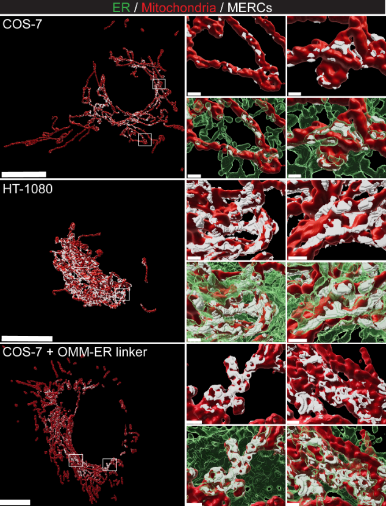

# SubPrecisionContactDetection.jl Documentation

Welcome to the documentation for this package.
Please see the sidebar for relevant sections.

The below 3D rendering shows the software predicting ER-Mitochondria contacts in 3D STED (credit DOI 10.1083/jcb.202206109).
