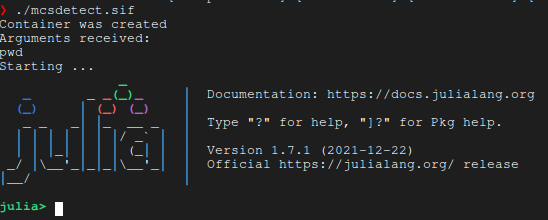
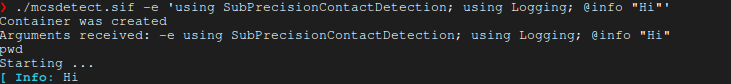
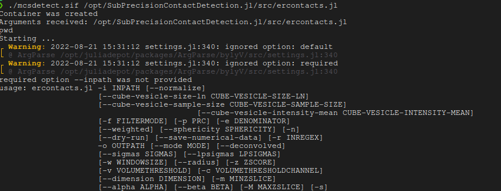
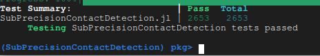
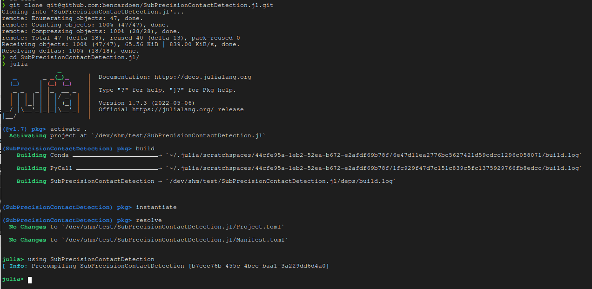

## Installation
This project is developed using [Julia](https://julialang.org/).
For ease of use and to maximize reproducibility we also provide container images using Singularity.

This project was developed on Linux, and deployed on scientific computing clusters running Linux. The Singularity workflow ensures both local and cluster computations run **exactly** the same. The automated tests run the exact same environment.

This cannot be guaranteed across different OS'es (e.g. Windows, MacOs). While there are no technical reasons preventing the code from working on any OS, you may run into issues as it is not something we actively use ourselves.

<a name="singularity"></a>
### Portable & fastest way using Singularity
You can use an optimized [Singularity](https://docs.sylabs.io/guides/2.6/user-guide/installation.html#) image, which has all dependencies pre-installed.

If you do not have Singularity, please see the documentation for detailed [installation instructions](https://docs.sylabs.io/guides/2.6/user-guide/installation.html#).

The below steps are examples, but may not be complete for each platform, for the reference instructions, please visit [installation instructions](https://docs.sylabs.io/guides/2.6/user-guide/installation.html#).

#### Singularity on Linux
Fedora/RPM
```bash
sudo dnf install singularity
```

#### Singularity on Windows
To run Singularity on Windows, set up [WSL2](https://www.blopig.com/blog/2021/09/using-singularity-on-windows-with-wsl2/) or refer to [installation instructions](https://docs.sylabs.io/guides/2.6/user-guide/installation.html#).

#### Singularity on MacOS
See [instructions](https://docs.sylabs.io/guides/2.6/user-guide/installation.html#install-on-mac).

#### Download the image

Download the [image](http://vault.sfu.ca/index.php/s/QJ4Evcet4oVWXPL/download) as *mcsdetect.sif*.
For example, using wget (Linux), you could do:
```bash
wget -O mcsdetect.sif http://vault.sfu.ca/index.php/s/QJ4Evcet4oVWXPL/download
```

On MacOS you can install wget using:
```bash
brew install wget
```

### Using the image
First, make sure execute permissions are set:
```bash
chmod u+x mcsdetect.sif
```

#### Starting an interactive Julia session
```bash
./mcsdetect.sif
```
Expected output:



#### Running code snippets
```bash
chmod u+x mcsdetect.sif
./mcsdetect.sif -e 'using SubPrecisionContactDetection;'
```
Expected output:



#### Running the analysis scripts
```bash
chmod u+x mcsdetect.sif
./mcsdetect.sif /opt/SubPrecisionContactDetection.jl/scripts/ercontacts.jl ARGS
```
Where you'd replace ARGS with arguments to the script as documented in [scripts/ercontacts.jl](https://github.com/bencardoen/SubPrecisionContactDetection.jl/blob/main/scripts/ercontacts.jl).
Run it without arguments to get the help prompt.

Expected output:


<a name="julia"></a>
### Install as a Julia package

**Note due to a [bug with conda](https://github.com/conda/conda/issues/10111) MacOS installations will have some tests failing, the module itself is functional**

You can either add to the global Julia installation:

```bash
julia -e 'using Pkg;Pkg.add(url="https://github.com/bencardoen/Colocalization.jl.git");Pkg.add(url="https://github.com/bencardoen/ERGO.jl.git");Pkg.add(url="https://github.com/bencardoen/SPECHT.jl.git");Pkg.add(url="https://github.com/bencardoen/SubPrecisionContactDetection.jl.git")'
julia -e 'using Pkg; Pkg.build("SubPrecisionContactDetection");Pkg.test("SubPrecisionContactDetection")'
```


Or create a new environment and install it there:

```bash
mkdir -p test
cd test
julia --project=. -e 'using Pkg;Pkg.add(url="https://github.com/bencardoen/Colocalization.jl.git);Pkg.add(url="https://github.com/bencardoen/ERGO.jl.git");Pkg.add(url="https://github.com/bencardoen/SPECHT.jl.git");Pkg.add(url="https://github.com/bencardoen/SubPrecisionContactDetection.jl.git")'
julia --project=. -e 'using Pkg; Pkg.build("SubPrecisionContactDetection");Pkg.test("SubPrecisionContactDetection")'
```

In both cases, you should see that all tests pass:



### Install the cloned repository (gives access to the processing CLI interface)
```bash
git clone https://github.com/bencardoen/SubPrecisionContactDetection.jl.git
cd SubPrecisionContactDetection.jl
julia --project=. installlocal.jl
```

This should result in output similar to this screenshot:




<a name="windows"></a>
### 1.3 Windows
- Install [VSCode](https://code.visualstudio.com/download)
- Install [Python](https://www.python.org/downloads/)
- Install [Julia 1.9](https://julialang-s3.julialang.org/bin/winnt/x64/1.9/julia-1.9.4-win64.exe)
In VSCode, create a new folder and open VSCode inside of it.

Then:
- New Terminal
In the terminal, type:
```bash
git clone https://github.com/bencardoen/SubPrecisionContactDetection.jl.git
```
This will download the latest version of the source code.
**Note** Python needs to be installed and defined, make sure of this step before proceeding.
Now we will build it:
```
julia --project=. -e 'using Pkg; Pkg.build() Pkg.test()'
```

