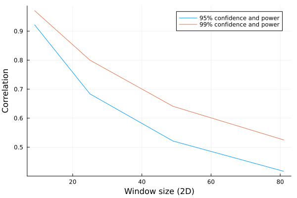
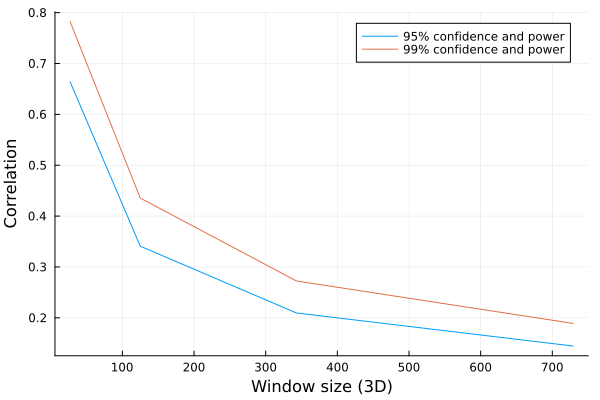
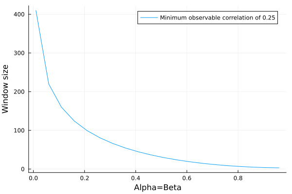

This section describes the usage of parameters for the scripts and the algorithm.

## Index
```@index
```

## Checking default values
```julia
params = get_defaults()
for k in keys(params)
    @info "$k ==> $(params[k])"
end
```

### Parameter selection
MCS-Detect has multiple parameters that will determine the precision and recall of the predicted contacts. 
While a full discussion is available in the paper, here we will give a brief explanation and guidance as to how to set them.

#### Z-filter (background removal)

##### Concept
Because 3D STED has anisotropic resolution in Z (worse in Z than in X/Y), it is possible to see intensity `bleedthrough` or `shadowing` across Z. 
For example, say you have a mitochondrial vesicle at Z-slice 5. 
Bleedthrough can lead to intensity mimicking a faint object at Z-slice 8.
The Z-filter removes this by filtering the intensity distribution, per channel.
If you set Z=1, all intensity **below** $\mu + 1 * \sigma$ is set to zero.

##### Guidance
A z-value is that is too high will cause false negatives because you're removing intensity from the organelles, not the background.
A too low value will included possible contacts between organelles and phantom intensity, e.g. false positives.
A value of z=3 is used for the paper, derived from the size of the cell and the anisotropy. 
Recommended usage is to test Z-values on a single representative cell, and plot the organelle volume, in combination with visual inspection. 
Instructions on how to do this and accompanying scripts can be found [here](https://github.com/NanoscopyAI/tutorial_mcs_detect?tab=readme-ov-file#mcs-detect-background-filtering-only--segmentation).


#### Window size (w)

##### Concept
Correlation requires a comparison between two vectors of data, in 2- or 3D images this means a window size. 
If you set w=2 the window will be (2*2+1)^D for D dimensions.
So 5x5 in 2D, 5x5x5 in 3D. w=1 would be 3x3, or 3x3x3 and so forth.

##### Guidance
A too large value will consume more memory, and will miss finer patterns. 
A too small value will fail to capture large patterns. 
So what, then is 'too' small or large?
At a minimum, the window should cover the width of the contact, but no more than 2.5x. 
The interested reader will detect similarities with how resolution and pixel-dimensions relate.
I will give an example to give a more actionable insight:
Let us assume pixel precision is 50nm in X, Y, and 75nm in Z.
Say the expected contacts you wish to capture are 0-25nm. 
In this case w=1 would be sufficient, because a window of 3x3x3 would span 150nm lateral, and 225nm axial. 
W=2 would mean 250nm lateral and 375nm axial, which is likely too large, it would be dominated by differentials that are unrelated to the contact.
**Important** The window size determines the statistical power of the correlation. A 3x3 window in 2D has limited statistical power. See below.


#### Alpha and Beta, or confidence, significance, and power.

##### Concept
A correlation is a statistical estimator, and comes with a confidence value ('p-value'). 
Alpha control what acceptable levels of confidence are allowed, whereas beta controls statistical power. 
A recap from statistics:
- Significance (alpha): The probability that an observed difference is not due to random effects
- Power (beta): The probability that you can observe a given difference (of a given magnitude)

What does this mean in practice?
We can compute what is **minimal** observable correlation you can detect, given alpha and beta.
First, the 2D case (so 3x3, 5x5, ...)



Next, 3D:




Trouble reading these plots?
Let's say you use a 3x3x3 window (w=1, in 3D). 
If you set alpha=beta=0.05 (95% confidence and power), then the smallest possible observable correlation is **0.665**. (In the 2nd plot, X=27, Y=0.665).

Suppose you increase the window to w=2, 3D, then you have **0.341** (X=125, Y=0.341).

If you want to have the same minimum correlation in 3D with a window of 27, you would need to change your alpha and beta to **0.35**

We can also plot this 




The functions to compute this are available for you as well:
```julia
# w=2, 2D
minr = compute_min_r_for_sample_corr(25, 0.05, 0.05)
```
and
```julia
# r=0.2, 2D
window = compute_sample_size_for_min_corr(0.2, 0.05, 0.05)
```

##### Guidance
- If you keep the window the same, and go to 2D, set alpha and beta from to have the same recall.
- If precision is too low, reduce alpha and beta (e.g. 0.05 to 0.1, or 0.25).
- If recall is too high (artifacts), increase alpha and beta (0.05 to 0.01 or 0.001)

#### Vesicle filtering
##### Concept
The postprocessing scripts use size (logarithm) and mean intensity of vesicles to filter them out. 
This can only be empirically estimated. 

##### Guidance
Plot the intensity and object sizes of the mitochondria channel, and look for a separation between large and bright objects, versus small and faint.
Off the shelf clustering methods can be of help.
Alternatively, segment the image before processing. 
**NOTE** Contact detection does not differentiate between mitochondria and vesicles, the interaction may be functionally different, but the contacts are no less real.


#### Sampling
##### Concept
Because contacts are large and infrequent, or small and frequent, the statistical analysis can be unstable. 
More precisely, the distribution is long tailed containing extreme values, and those extreme values are often the ones of interest (e.g. ribomerc).
To offset this, the coverage computation and local density (nr of contacts/window) uses a window, defaulting to 5x5x5 (which corresponds to w=2). 
##### Guidance
The smaller you set this, the more you split objects apart. 
Ideally you set this window to be no smaller than the largest expected object.
Sampling windows do not overlap, and mitochondria that are only partially visible in a window (few voxels), are discarded.
