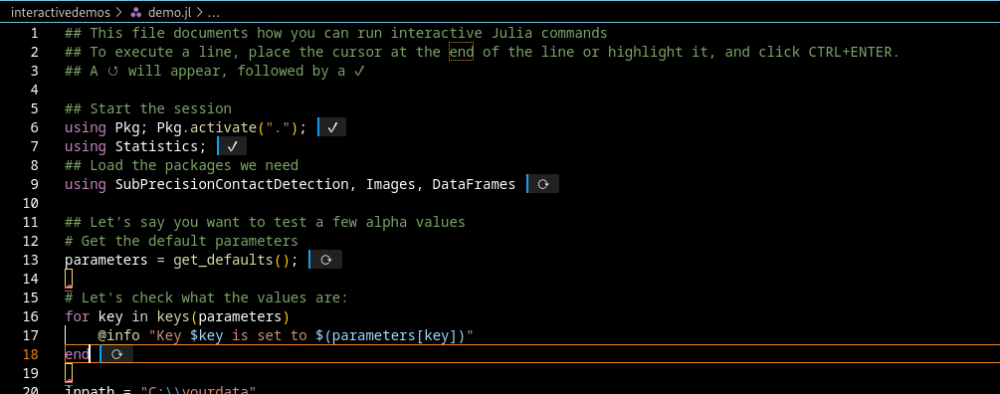

# Tutorial
The below assumes you have the source code installed as per the installation instructions.

The [Parameter selection and tuning.](@ref) section will explain what parameters there are, and guide you through the parameter selection.

## Processing a single cell (3D STED) with two channels
```
julia --project=. scripts/ercontacts.jl -i <data> -o <output>
```

## Processing a dataset with multiple channels
```
julia --project=. scripts/batch.jl -i <data> -o <output> -r "*[1,2,3].tif"
```
This expects the data to be organized like so
```
- top folder
  - replicate number
    - cell type
      - Seriesxyz 
        - ...0.tif
        - ...1.tif
        - ...2.tif 
        - ...3.tif
        - ...4.tif
```
In this case the `"*[1,2,3].tif"` parameters indicate that you want contacts between the pairs of channels of files ending with 1,2, and 3. 
The code will check your data, and if those files are there, you will get output like

```
1--2/
    replicate 
        cell 
            ...
1--3/
2--3/
```


## Interactive usage
In VSCode, navigate to [demo.jl](https://github.com/bencardoen/SubPrecisionContactDetection.jl/blob/main/interactivedemos/demo.jl)

If you have Julia and its plugin installed, you can now evaluate code line by line.

For example:



This would work like this:

```julia
using Pkg; Pkg.activate("."); # <CTRL+ENTER>
using SubPrecisionContactDetection; # <CTRL+ENTER>
@info "Test"; #CTRL+ENTER
defs = get_defaults(); #CTRL+ENTER
```

## Julia API
While you can call the scripts from the command line, you can also do so from within Julia:

```julia
using SubPrecisionInteractionDetection
twochannel_contats(get_defaults());
```
